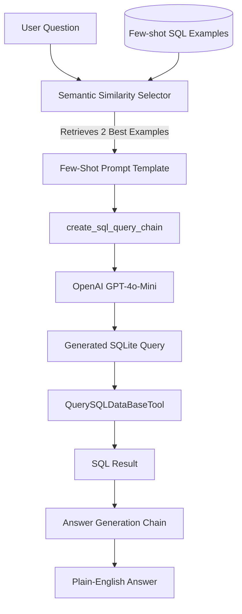

# Text-to-SQL Assistant

A modern, semantic Text-to-SQL application built with LangChain, OpenAI, and Qdrant. It translates natural language questions into executable SQLite queries, runs them against a local database, and provides natural language answers.

## Architecture & How It Works

The application operates on a few-shot learning semantic retrieval pipeline:



1. **Database Connection**: Connects to the local SQLite database (`atliq_tshirts.db`) containing `t_shirts` and `discounts` tables.
2. **Semantic Search / Vector Store**: Embedded few-shot SQL examples are stored in a local **Qdrant Vector Database** (`./VECTOR_DB`) using **HuggingFace Sentence-Transformers** (`all-MiniLM-L6-v2`).
3. **Dynamic Few-Shot Injection**: A `SemanticSimilarityExampleSelector` selects the top 2 most relevant examples based on the user's question, injecting them into the LLM prompt.
4. **SQL Execution**: The generated SQL query is stripped/cleaned and executed against the database.
5. **Answer Generation**: The prompt combines the original question, the generated SQL, and the query results, passing them back to the LLM to format a user-friendly, plain-English response.

---

## Tech Stack

- **Framework**: [LangChain](https://github.com/langchain-ai/langchain) / LangChain Classic
- **LLM Provider**: [OpenAI API](https://openai.com/) (`gpt-4o-mini`)
- **Embeddings Model**: `sentence-transformers/all-MiniLM-L6-v2` (HuggingFace)
- **Vector Database**: [Qdrant](https://qdrant.tech/) (Local Storage)
- **Database**: SQLite
- **Environment & Packages Manager**: `uv` / python-dotenv

---

## File Structure

- `main.py`: Main python entrypoint containing database connectivity, LangChain pipelines, prompts, vector indexing, and smoke tests.
- `atliq_tshirts.db`: SQLite database containing T-shirts inventory data.
- `pyproject.toml` / `uv.lock`: Project dependencies and lock files managed by `uv`.
- `.env.sample` / `.env`: Environment configuration files.

---

## Setup & Running Guide

### 1. Prerequisites
Install `uv` (a fast Python package installer and resolver) if you haven't already:
```bash
# Windows (PowerShell)
irm https://astral.sh/uv/install.ps1 | iex
```

### 2. Configure Environment Variables
Create a `.env` file in the root directory:
```bash
cp .env.sample .env
```
Open the `.env` file and replace the placeholder with your actual OpenAI API key:
```env
OPENAI_API_KEY=your-actual-api-key-here
```

### 3. Install Dependencies and Run
Run the application with `uv`, which automatically creates a virtual environment, syncs the dependencies, and runs the script:
```bash
uv run python main.py
```
